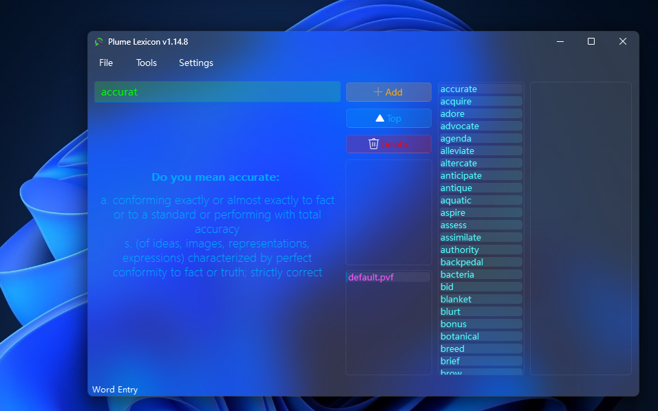
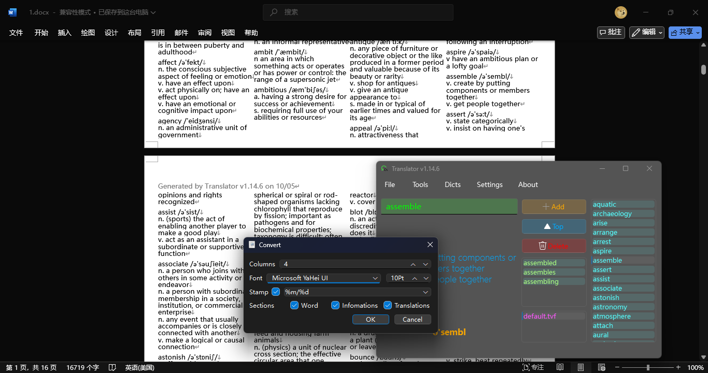

# Translator
**A simple locale translation tool at your service.**

### Origin
 In my quest of *4000 Essential Words* , I grappled with unfamiliar terms that were hard to comprehend and summarize. Hence, the idea for this app blossomed...

### Functions

 - Base translate / correct function \
  ")
  

 - Generate documents (using `python-docx` lib) \
  

 - Import / Export \
  

 - Dictionaries management  
    

 - Setting / MultiLanguage  
    
    

 - File operation \
  
